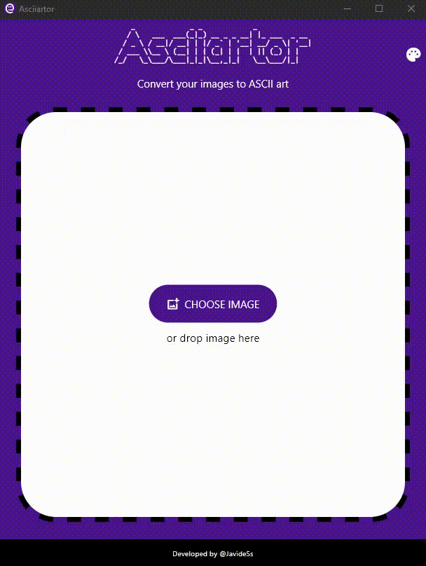

# Asciiartor
Asciiartor is a simple cross-platform application for converting images to ascii art.



---

## How to use it
Flutter must be installed.
And `flutter doctor` returns no problems.

```
# Clone project
git clone https://github.com/JavideSs/asciiartor.git
cd asciiartor

# Install dependencies
flutter pub get

# Run asciiartor
flutter run

# Compile asciiartor
dart run flutter_launcher_icons
flutter build <platform> --release
```

---

## Dependencies
- Flutter (3.44.9) & Dart (3.12.2).
- Refer to [pubspec.yaml](pubspec.yaml)

---

## Feedback
Your feedback is most welcomed by filling a
[new issue](https://github.com/JavideSs/asciiartor/issues/new).

---

Author:  
Javier Mellado Sánchez  
2025 - 2026